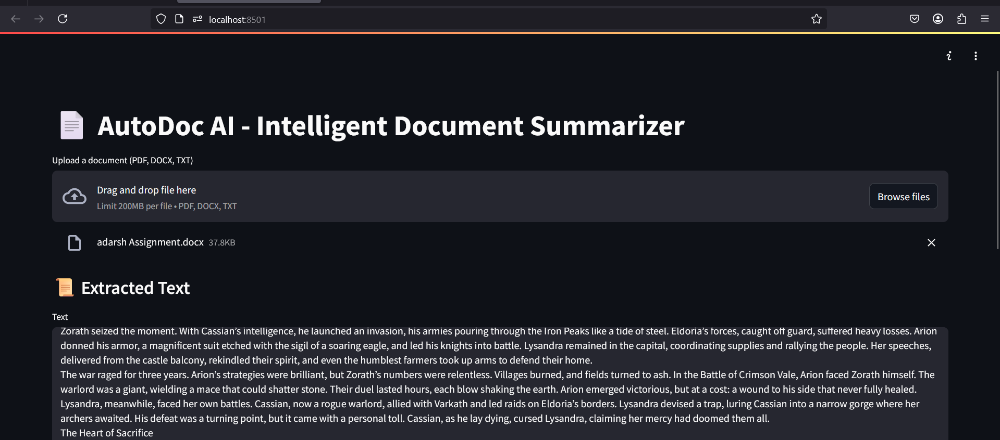
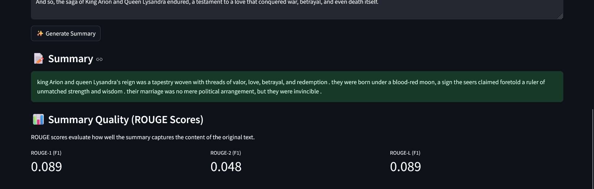

# AutoDoc-AI
**AutoDoc AI** is an intelligent document summarization tool built with Streamlit. It allows users to upload PDF, DOCX, or TXT files, extracts the text, generates a concise summary using a transformer-based model (`t5-small`), and evaluates the summary quality with ROUGE scores. The app is designed for researchers, students, or professionals who need quick, accurate summaries of lengthy documents.

## Features

- **File Upload**: Upload PDF, DOCX, or TXT files via a user-friendly Streamlit interface.
- **Text Extraction**: Extracts the full text from uploaded documents without saving files to disk.
- **Abstractive Summarization**: Generates descriptive summaries using the `t5-small` model from the `transformers` library.
- **ROUGE Evaluation**: Computes ROUGE-1, ROUGE-2, and ROUGE-L F1 scores to assess summary quality.
- **Full Text Display**: Displays the entire extracted text in a scrollable text area, with no character limits.
- **Error Handling**: Robust error handling for file processing and summarization.

## Screenshots

Below are screenshots of the AutoDoc AI interface:

1. **Main Interface (File Upload and Text Extraction)**:
   

2. **Summary and ROUGE Scores**:
   

## Installation

### Prerequisites

- Python 3.8 or higher (tested with Python 3.11, but 3.10 recommended for compatibility)
- A virtual environment (recommended)
- Git (optional, for cloning the repository)

### Steps

1. **Clone the Repository**:
   ```bash
   git clone https://github.com/your-username/AutoDoc-AI.git
   cd AutoDoc-AI
       Create a Virtual Environment:
    bash

    python -m venv venv
    source venv/bin/activate  # On Windows: venv\Scripts\activate

    Install Dependencies: Install the required Python packages using pip:
    bash

    pip install streamlit PyMuPDF python-docx transformers nltk rouge

    Download NLTK Data: The summarization module requires the NLTK punkt tokenizer. Download it by running:
    bash

    python -c "import nltk; nltk.download('punkt')"

Usage

    Run the Streamlit App: Start the Streamlit server:
    bash

    streamlit run app.py

    This will open the app in your default web browser (typically at http://localhost:8501).

    Upload a Document:

        Use the file uploader to select a PDF, DOCX, or TXT file.

        The app will extract and display the full text in a scrollable text area.

    Generate a Summary:

        Click the "Generate Summary" button.

        The app will process the text, generate a summary, and display ROUGE scores (ROUGE-1, ROUGE-2, ROUGE-L F1) to evaluate the summary quality.

    Review Output:

        The extracted text, summary, and ROUGE scores are shown in the interface.

        Scroll through the text area to view the full document content.

Project Structure
plain

AutoDoc-AI/
├── app.py              # Main Streamlit app
├── utils.py            # Text extraction functions for PDF, DOCX, TXT
├── summarizer.py       # Summarization logic using t5-small model
├── screenshot1.png     # Screenshot of file upload and text extraction
├── screenshot2.png     # Screenshot of summary and ROUGE scores
├── README.md           # Project documentation

Dependencies

    streamlit: For the web interface

    PyMuPDF: For PDF text extraction

    python-docx: For DOCX text extraction

    transformers: For abstractive summarization (t5-small model)

    nltk: For sentence tokenization

    rouge: For ROUGE score evaluation

Install all dependencies with:
bash

pip install streamlit PyMuPDF python-docx transformers nltk rouge

Limitations

    Model Performance: The t5-small model is lightweight but may produce less detailed summaries compared to larger models like facebook/bart-large-cnn. Consider upgrading the model for better results (update summarizer.py).

    Large Files: Very large documents may slow down text display or summarization. Pagination or chunking can be implemented for improved performance.

    ROUGE Scores: ROUGE measures word overlap, so it may undervalue creative abstractive summaries.

Future Improvements

    Add support for additional file formats (e.g., HTML, Markdown).

    Implement a model selection dropdown (e.g., t5-base, bart-large-cnn).

    Add pagination for displaying very large extracted texts.

    Include a downloadable text file option for extracted text and summaries.

    Optimize summarization for faster processing of large documents.

Contributing

Contributions are welcome! To contribute:

    Fork the repository.

    Create a new branch (git checkout -b feature/your-feature).

    Make your changes and commit (git commit -m "Add your feature").

    Push to the branch (git push origin feature/your-feature).

    Open a pull request.

Please ensure your code follows PEP 8 style guidelines and includes appropriate tests.
